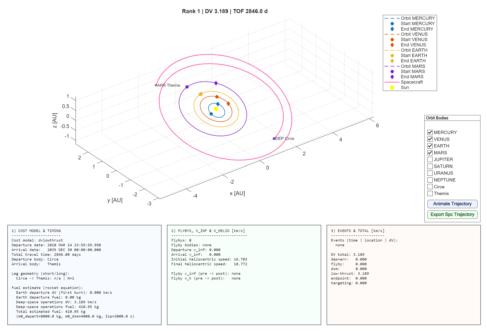

# Example of Low Thrust Transfer Between Circe and Themis using LOTUS
The following example describes the general steps to run a simulation using LOTUS to obtain a trajectory from the asteroid Circe to the asteroid Themis using low thrust legs. 

## Body and Time Window Selection
Two slots were used to perform this analysis. Slot 1 represents Circe and the time window selected was ["2025 JAN 01", "2029 DEC 31"]. Slot 2 represents the arrival body, in this case Themis. The arrival time window covered during the optimization algorithm was ["2027 JAN 01", "2035 DEC 31"]. `stepDays` was kept at 7.

The `tofConstraints` variable was kept significantly large to accommodate all possible interactions and permutations. 

## Long Way, Transfer Type, and Nrev
For this analysis, the recommended `both` command was used in the `longWay` field. `transferType` was set to `lowthrust`, and the number of revolutions (`Nrev`) covered from 0 to 6. 

## Leg Cost Model and Auto flyby
The `legCostModel` for `lowthrust` legs bypasses the user input and seeks to minimize the total thrust. 

The `autoflyby` mode was disabled. However, it is possible to enable it for further exploration if desired. However, the users should be warned that this implementation is yet not fully functional and in some cases it might work while in others don't. 

## Run Options
Standard run options were used with `diversityMode` set to `exploratory` with a `diversityMinSpacingDaysBySlot` of 30 days. 

## Results

The results from LOTUS are detailed below. Technical observations are present in the 3 columns at the end of the figure.

1. **Cost Model & Timing**: Describes the cost model, general trajectory details, and brief fuel estimates.
2. **Flybys, V_inf & V_helio**: Describes the total number of flybys performed and details the velocity of the body at each encounter before and after the flyby.
3. **Events and Total DV**: Lists all the events during the trajectory with respective time and displays an overall summary of DV.  

In the case of low thrust maneuvers, an additional plot is shown that displays the thrust magnitude and the fuel mass used over time. 

Moreover, the plot is also interactive. Users can visualize an animation of the trajectory as well as export the spacecraft ephemeris (time and position) by pressing the respective buttons. 

**NOTE**: The raw output file for this simulation is not attached due to size limitations. 