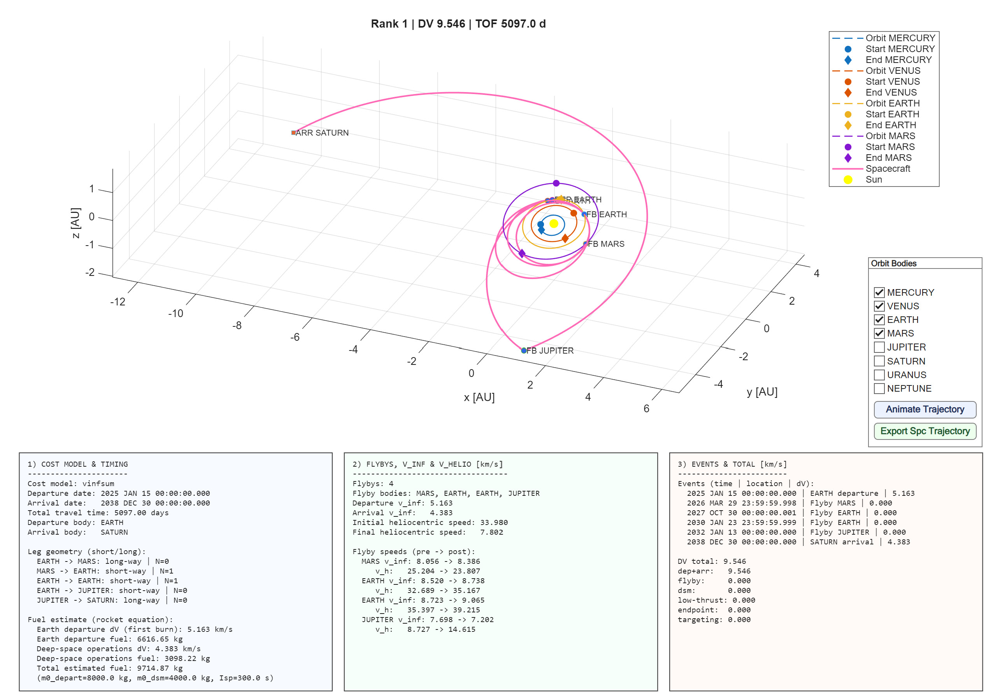

# Example of Mission to Saturn Using LOTUS
The following example describes the general steps to run a simulation using LOTUS to obtain a trajectory from the Earth to planet Saturn while exploring a trajectory space contemplated with four flybys. 

## Body and Time Window Selection
Two slots were used to perform this analysis. Slot 1 represents the Earth and the time window selected was ["2025 JAN 01", "2025 DEC 31"]. Slot 2 represents the arrival body, in this case Saturn. The arrival time window covered during the optimization algorithm was ["2029 JAN 01", "2038 DEC 31"]. Because the time window is large and the number of intermediate bodies is also considerable, stepDays was kept at 14. 

The `tofConstraints` variable was kept significantly large to accommodate all possible interactions and permutations. 

## Long Way, Transfer Type, and Nrev
For this analysis, the recommended `both` command was used in the `longWay` field. `transferType` was set to `nonresonant`, and the number of revolutions (`Nrev`) included both 0 and 1. Keep in mind that such definitions increase exponentially the number of solutions considered. 

## Leg Cost Model and Auto flyby
The `legCostModel` was kept at `vinfsum` for simplicity. 

The `autoflyby` mode was enabled with a maximum number of flybys set to 4. The settings allowed to repeat flyby bodies and the `candidateBodies` were chosen as ["EARTH", "MARS", "JUPITER"]. 

It should be mentioned that such a configuration resulted in more than 1.5 billion combinations of possible encounters. Parallel processing is strongly recommended to avoid memory issues. 

## Run Options
Standard run options were used with `diversityMode` set to `exploratory` with a `diversityMinSpacingDaysBySlot` of 30 days. 

## Results

The results from LOTUS are detailed below. Technical observations are present in the 3 columns at the end of the figure.

1. **Cost Model & Timing**: Describes the cost model, general trajectory details, and brief fuel estimates.
2. **Flybys, V_inf & V_helio**: Describes the total number of flybys performed and details the velocity of the body at each encounter before and after the flyby.
3. **Events and Total DV**: Lists all the events during the trajectory with respective time and displays an overall summary of DV.  

Moreover, the plot is also interactive. Users can visualize an animation of the trajectory as well as export the spacecraft ephemeris (time and position) by pressing the respective buttons. 

**NOTE**: The raw output file for this simulation is not attached due to size limitations. 